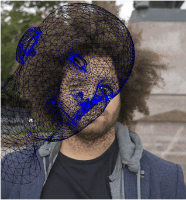

  <h1 align="center">Facebuilder Tool</h1>
  

    <a href="https://www.cubox.ai/"><strong>CUBOX AI Lab</strong></a>
  

  

    
  

  

    
    
  

## Overview

FaceBuilder is a sophisticated 3D face modeling tool developed by Keentools that allows precise manipulation of 3D facial meshes using a pin-based deformation system. The tool supports interactive mesh editing across multiple views with synchronized 3D consistency.

## Key Features

### Multiview 3D Mesh Editing System 

- Able to deform the mesh using multiview input images**: 
  - A single shared 3D mesh maintains consistency between all input images

### Automatic Face Alignment

- **Detection**: Uses both MediaPipe and dlib for robust 2D face detection in various poses
- **Multi-stage Alignment**: 
  - Detects face landmarks automatically in the current image
  - Performs 3D pose estimation to calculate optimal rotation and translation
  - Uses PnP (Perspective-n-Point) algorithm to align the 3D mesh with 2D landmarks

### Multi-mode Pin System

FaceBuilder implements an intuitive pin-based interaction system with three specialized manipulation modes:

#### Single Pin (1-Pin) Mode

- **Rotation Mechanism**: Mouse movements (dx, dy) are converted to rotation elements
  - Horizontal movement (dx) → Y-axis rotation
  - Vertical movement (dy) → X-axis rotation
  - These rotation values are combined with the existing rotation matrix for natural rotation
- The entire mesh follows the mouse position precisely via calculated translation values
- Ray casting techniques ensure 2D mouse input accurately reflects on the 3D mesh
- Face structure maintains integrity while rotating naturally according to mouse movement

#### Dual Pin (2-Pin) Mode

- **Scaling Behavior**:
  - Pulling pins outward → Enlarges the mesh
  - Pulling pins inward → Reduces the mesh
- Non-dragged pin remains fixed in both mesh and image space
- All rotation and scaling operations use the fixed pin as a reference point
- Allows precise control of mesh size while maintaining proportions

#### Triple Pin (3-Pin) Mode

- **3D Rotation Control**: Dragging the third pin while using two fixed pins as anchor points
- Uses PnP algorithm to calculate accurate 3D rotation and translation
- Maintains proportions while enabling precise mesh control
- Two non-dragged pins remain exactly fixed in their original positions